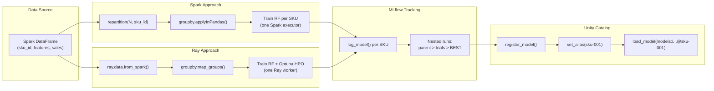
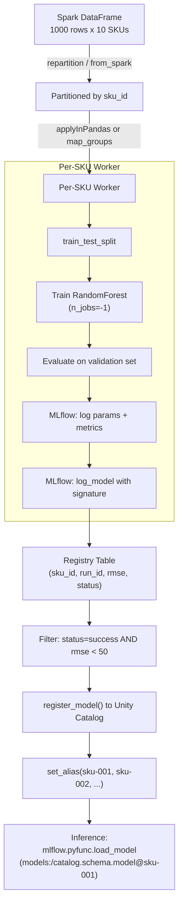
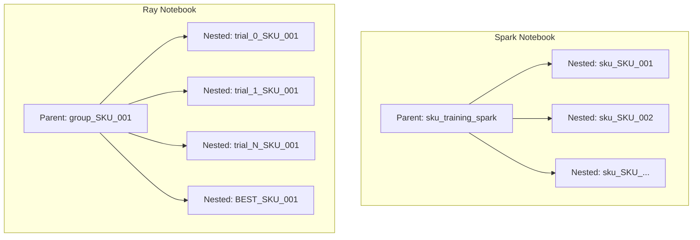

# Many-Model Forecasting on Databricks

Train one scikit-learn model per SKU (or any group key) and manage the full
lifecycle — training, hyperparameter optimization, model registry, and
inference — using Unity Catalog and MLflow on Databricks.

This project provides two approaches to the same problem so you can choose
the right tool for your scale:

| Notebook | Approach | Best for |
| --- | --- | --- |
| `multi-model-spark.py` | Spark `applyInPandas` | Simple per-group training, no HPO, fewer SKUs |
| `multi-model-ray.py` | Ray Data `map_groups` + Optuna HPO | HPO per group, 1000s+ SKUs, GPU models |

## Architecture



## Data Flow



## Approach Comparison

| Dimension | Spark `applyInPandas` | Ray `map_groups` |
| --- | --- | --- |
| **Scheduling overhead** | ~seconds per task | ~milliseconds per task |
| **Max practical groups** | 100s - 1000s | 1000s - 1M+ |
| **HPO integration** | Manual loop or Hyperopt | Optuna (Bayesian TPE) |
| **GPU support** | Limited (Spark GPU scheduling) | Native (`num_gpus` per task) |
| **Data transfer** | Arrow (Spark to Python) | Arrow (Spark to Ray, zero-copy) |
| **Autoscaling** | Databricks autoscale (node-level) | Ray autoscale (task-level) |
| **Infrastructure** | Spark cluster only | Spark + Ray (additional setup) |
| **MLflow bottleneck** | `log_model()` per group | Same |

**Rule of thumb:** Start with Spark `applyInPandas` for simplicity.  Move to
Ray when you need HPO per group, have 1000s+ groups, need GPU scheduling, or
hit Spark's per-task scheduling overhead.

## Configuration

Both notebooks use Databricks widgets for configurable parameters:

| Widget | Default | Description |
| --- | --- | --- |
| `catalog_name` | `albertsons` | Unity Catalog catalog for tables and models |
| `schema_name` | `forecasting` | Schema within the catalog |

### Setting via notebook UI

Widgets appear at the top of the notebook when you run it.  Type new values
and re-run the Configuration cell.

### Setting via job parameters

```python
dbutils.notebook.run("multi-model-spark", timeout_seconds=3600, arguments={
    "catalog_name": "prod",
    "schema_name": "ml_forecasting",
})
```

### Tables and models created

| Asset | Spark notebook | Ray notebook |
| --- | --- | --- |
| Registry table | `{catalog}.{schema}.sku_model_registry` | `{catalog}.{schema}.sku_model_registry_ray` |
| UC model | `{catalog}.{schema}.sku_model` | `{catalog}.{schema}.sku_model_ray` |

## Cluster Requirements

### Spark notebook (`multi-model-spark.py`)

- **Runtime:** DBR 15.4 LTS ML or later
- **Workers:** CPU instances (e.g. `m5.xlarge`, `i3.xlarge`)
- **Min nodes:** 1 driver + 1 worker (more workers = more parallel SKUs)
- No special Spark configs required

### Ray notebook (`multi-model-ray.py`)

- **Runtime:** DBR 15.4 LTS ML or later (includes Ray 2.x)
- **Workers:** CPU instances (e.g. `m5.xlarge`); for GPU models use `g4dn.xlarge`
- **Min nodes:** 1 driver + 2 workers (Ray on Spark requires multi-node)
- **Recommended Spark configs:**

  ```
  spark.task.resource.gpu.amount  0       # Reserve GPUs for Ray, not Spark
  RAY_memory_monitor_refresh_ms   0       # Avoid spurious OOM kills
  ```

## Usage

### 1. Import notebooks

Upload both `.py` files to your Databricks workspace (e.g.
`/Repos/<user>/multi-model/`).

### 2. Attach to a cluster

Use a cluster that meets the requirements above.  For the Ray notebook,
ensure it is a multi-node cluster.

### 3. Run the notebook

Run all cells top to bottom.  The notebooks will:

1. Create the catalog and schema if they don't exist.
2. Generate synthetic training data (10 SKUs x 100 rows each).
3. Train one model per SKU (Spark) or one model with HPO per SKU (Ray).
4. Write a registry table with training results.
5. Register top models in Unity Catalog with per-SKU aliases.
6. Demonstrate loading a model by alias and running inference.

### 4. Adapting for your data

Replace the synthetic data cell with a read from your feature table:

```python
df = spark.read.table("catalog.schema.sku_features")
```

Update `feature_cols` and `target_col` in the Configuration cell to match
your schema.

## MLflow Run Hierarchy



- **Spark notebook:** One parent run wraps all SKU child runs.
- **Ray notebook:** One parent run *per SKU* wraps that SKU's HPO trials, plus
  a `BEST_` run containing the winning model artifact.
