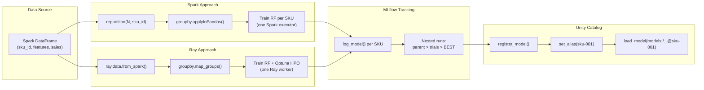
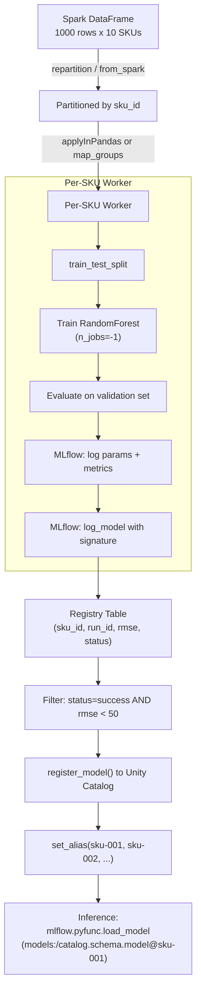
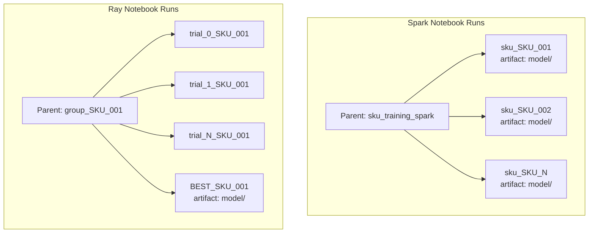
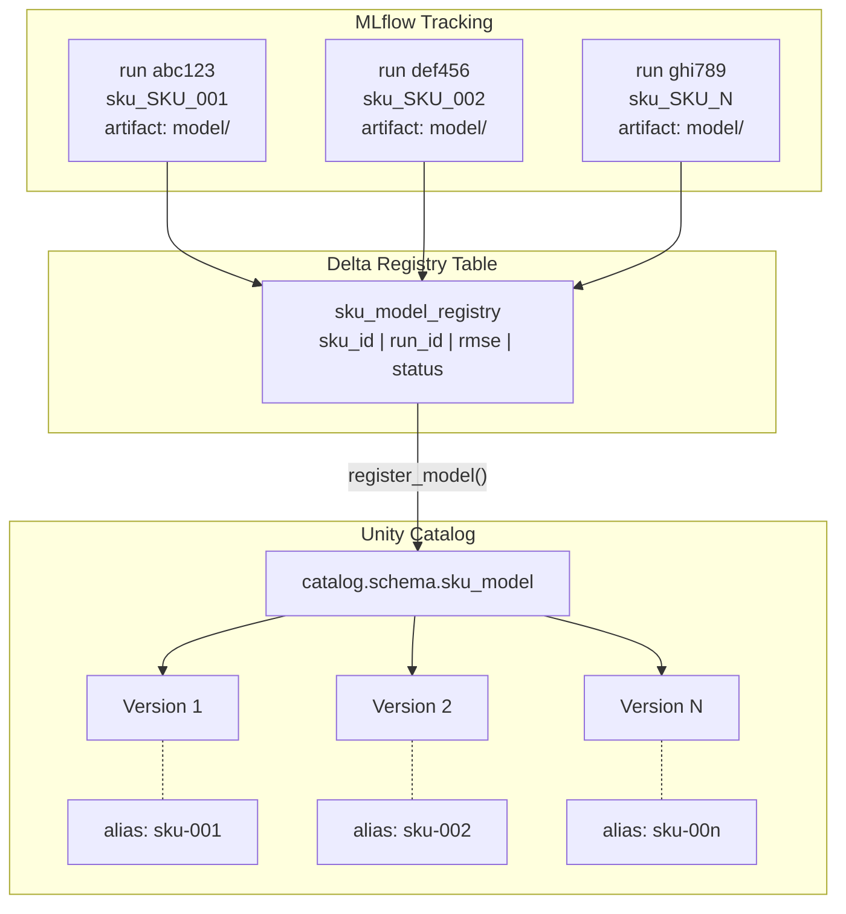
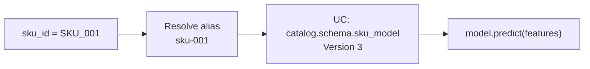
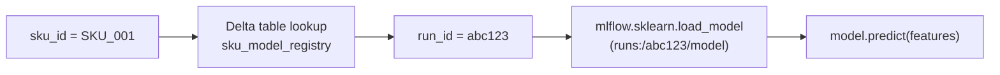
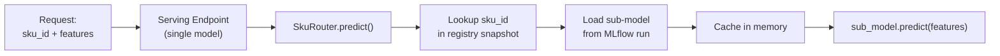
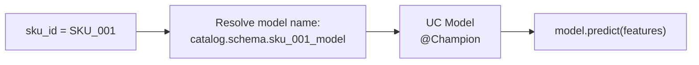

# Many-Model Forecasting on Databricks

Train one scikit-learn model per SKU (or any group key) and manage the full
lifecycle — training, hyperparameter optimization, model registry, and
inference — using Unity Catalog and MLflow on Databricks.

This project provides two approaches to the same problem so you can choose
the right tool for your scale:

| Notebook | Approach | Best for |
| --- | --- | --- |
| `multi-model-spark.py` | Spark `applyInPandas` | Simple per-group training, no HPO, fewer SKUs |
| `multi-model-ray.py` | Ray Data `map_groups` + Optuna HPO | HPO per group, 1000s+ SKUs, GPU models |

## Architecture



## Data Flow



## Approach Comparison

| Dimension | Spark `applyInPandas` | Ray `map_groups` |
| --- | --- | --- |
| **Scheduling overhead** | ~seconds per task | ~milliseconds per task |
| **Max practical groups** | 100s - 1000s | 1000s - 1M+ |
| **HPO integration** | Manual loop or Hyperopt | Optuna (Bayesian TPE) |
| **GPU support** | Limited (Spark GPU scheduling) | Native (`num_gpus` per task) |
| **Data transfer** | Arrow (Spark to Python) | Arrow (Spark to Ray, zero-copy) |
| **Autoscaling** | Databricks autoscale (node-level) | Ray autoscale (task-level) |
| **Infrastructure** | Spark cluster only | Spark + Ray (additional setup) |
| **MLflow bottleneck** | `log_model()` per group | Same |

**Rule of thumb:** Start with Spark `applyInPandas` for simplicity.  Move to
Ray when you need HPO per group, have 1000s+ groups, need GPU scheduling, or
hit Spark's per-task scheduling overhead.

## Configuration

Both notebooks use Databricks widgets for configurable parameters:

| Widget | Default | Description |
| --- | --- | --- |
| `catalog_name` | `albertsons` | Unity Catalog catalog for tables and models |
| `schema_name` | `forecasting` | Schema within the catalog |

### Setting via notebook UI

Widgets appear at the top of the notebook when you run it.  Type new values
and re-run the Configuration cell.

### Setting via job parameters

```python
dbutils.notebook.run("multi-model-spark", timeout_seconds=3600, arguments={
    "catalog_name": "prod",
    "schema_name": "ml_forecasting",
})
```

### Tables and models created

| Asset | Spark notebook | Ray notebook |
| --- | --- | --- |
| Registry table | `{catalog}.{schema}.sku_model_registry` | `{catalog}.{schema}.sku_model_registry_ray` |
| UC model | `{catalog}.{schema}.sku_model` | `{catalog}.{schema}.sku_model_ray` |

## Cluster Requirements

### Spark notebook (`multi-model-spark.py`)

- **Runtime:** DBR 15.4 LTS ML or later
- **Workers:** CPU instances (e.g. `m5.xlarge`, `i3.xlarge`)
- **Min nodes:** 1 driver + 1 worker (more workers = more parallel SKUs)
- No special Spark configs required

### Ray notebook (`multi-model-ray.py`)

- **Runtime:** DBR 15.4 LTS ML or later (includes Ray 2.x)
- **Workers:** CPU instances (e.g. `m5.xlarge`); for GPU models use `g4dn.xlarge`
- **Min nodes:** 1 driver + 2 workers (Ray on Spark requires multi-node)
- **Recommended Spark configs:**

  ```
  spark.task.resource.gpu.amount  0       # Reserve GPUs for Ray, not Spark
  RAY_memory_monitor_refresh_ms   0       # Avoid spurious OOM kills
  ```

## Usage

### 1. Import notebooks

Upload both `.py` files to your Databricks workspace (e.g.
`/Repos/<user>/multi-model/`).

### 2. Attach to a cluster

Use a cluster that meets the requirements above.  For the Ray notebook,
ensure it is a multi-node cluster.

### 3. Run the notebook

Run all cells top to bottom.  The notebooks will:

1. Create the catalog and schema if they don't exist.
2. Generate synthetic training data (10 SKUs x 100 rows each).
3. Train one model per SKU (Spark) or one model with HPO per SKU (Ray).
4. Write a registry table with training results.
5. Register top models in Unity Catalog with per-SKU aliases.
6. Demonstrate loading a model by alias and running inference.

### 4. Adapting for your data

Replace the synthetic data cell with a read from your feature table:

```python
df = spark.read.table("catalog.schema.sku_features")
```

Update `feature_cols` and `target_col` in the Configuration cell to match
your schema.

## Model Storage

Both notebooks produce three layers of artifacts.  Understanding where
models live is essential for choosing an inference strategy.

### MLflow Tracking (runs and artifacts)

Each per-SKU training produces an MLflow run containing params, metrics,
and a serialized model artifact (`model/`).  Runs are organized as nested
runs under a parent.



- **Spark:** One parent run wraps all SKU child runs.  Each child contains
  the model artifact.
- **Ray:** One parent run *per SKU* wraps that SKU's Optuna trials.  Only
  the `BEST_` child contains the final model artifact.

### Delta Registry Table (sku_id to run_id mapping)

After training, a Delta table maps each SKU to its best run:

| sku_id | run_id | rmse | mse | mae | num_rows | status |
| --- | --- | --- | --- | --- | --- | --- |
| SKU_001 | `abc123...` | 18.4 | 338.6 | 14.2 | 100 | success |
| SKU_002 | `def456...` | 21.1 | 445.2 | 16.8 | 100 | success |

This table is the bridge between MLflow tracking and the Unity Catalog
registry.  It also enables the "registry table lookup" inference strategy
described below.

### Unity Catalog Model Registry

Top-performing models (filtered by `status = 'success' AND rmse < 50`)
are registered as versions of a single UC model.  Each version gets a
per-SKU alias for lookup.



Both notebooks use the same registration and alias workflow.  The only
difference is the UC model name (`sku_model` vs `sku_model_ray`) and
the registry table name.

## Inference Strategies

Both notebooks currently use **Strategy A** (alias per SKU).  However,
there are several valid strategies for loading the right model at
inference time.  The best choice depends on the number of SKUs, whether
you need a serving endpoint, and how much operational complexity you
can tolerate.

### Strategy A: Alias per SKU (current implementation)

One UC registered model with N versions and N aliases.

```python
model = mlflow.pyfunc.load_model("models:/catalog.schema.sku_model@sku-001")
prediction = model.predict(features_df)
```



**Pros:** Native UC, automatic versioning, works with serving endpoints
(one endpoint per alias), lineage tracked.

**Cons:** Alias count grows linearly with SKU count.  At 10K+ SKUs,
alias management and version history become unwieldy.  Each SKU
requires its own serving endpoint if deployed for real-time inference.

### Strategy B: Registry table lookup (no UC registration)

Models stay as MLflow run artifacts.  A Delta table maps `sku_id` to
`run_id`.  No UC registration step at all.

```python
run_id = spark.read.table("catalog.schema.sku_model_registry") \
    .filter(f"sku_id = '{sku_id}' AND status = 'success'") \
    .select("run_id").first()[0]
model = mlflow.sklearn.load_model(f"runs:/{run_id}/model")
prediction = model.predict(features_df)
```



**Pros:** Scales to millions of SKUs.  No UC registration overhead
(the slowest step at scale).  Simple Delta table is the only metadata.

**Cons:** No UC versioning or lineage.  Cannot deploy to a Model
Serving endpoint directly.  Must manage model lifecycle manually.

### Strategy C: Pyfunc router model

A single UC registered model wraps a custom `mlflow.pyfunc.PythonModel`
that accepts `sku_id` in the input, looks up the right sub-model, and
routes prediction.  One serving endpoint handles all SKUs.

```python
class SkuRouter(mlflow.pyfunc.PythonModel):
    def load_context(self, context):
        import pandas as pd
        self.registry = pd.read_parquet(
            context.artifacts["registry_snapshot"]
        )
        self._cache: dict = {}

    def predict(self, context, model_input: pd.DataFrame) -> pd.DataFrame:
        results = []
        for sku_id, group in model_input.groupby("sku_id"):
            if sku_id not in self._cache:
                run_id = self.registry.loc[
                    self.registry["sku_id"] == sku_id, "run_id"
                ].iloc[0]
                self._cache[sku_id] = mlflow.sklearn.load_model(
                    f"runs:/{run_id}/model"
                )
            features = group.drop(columns=["sku_id"])
            preds = self._cache[sku_id].predict(features)
            results.append(
                pd.DataFrame({"prediction": preds}, index=group.index)
            )
        return pd.concat(results)
```



**Pros:** Single serving endpoint for all SKUs.  Clean deployment
story.  UC tracks the router model with full lineage.

**Cons:** Most complex to build and maintain.  Cold-start latency
when a new SKU is loaded for the first time.  Memory grows with the
number of distinct SKUs served.  Router model must be re-logged when
the registry snapshot changes.

### Strategy D: One registered model per SKU

N separate UC registered models (e.g., `catalog.schema.sku_001_model`,
`catalog.schema.sku_002_model`).  Each has its own version history and
Champion/Challenger aliases.

```python
model = mlflow.pyfunc.load_model(
    "models:/catalog.schema.sku_001_model@Champion"
)
prediction = model.predict(features_df)
```



**Pros:** Clean per-SKU lifecycle.  Each SKU has independent
Champion/Challenger aliases and version history.  Standard MLflow
promotion workflow applies to each model independently.

**Cons:** Creates N registered models in UC, cluttering the namespace.
At 10K+ SKUs this becomes difficult to manage.  Requires N serving
endpoints for real-time inference.

### Strategy Comparison

| Dimension | A: Alias per SKU | B: Table Lookup | C: Pyfunc Router | D: Model per SKU |
| --- | --- | --- | --- | --- |
| **UC models created** | 1 | 0 | 1 | N |
| **Max practical SKUs** | ~1000 | Millions | ~10K (memory) | ~1000 |
| **Serving endpoints** | N (one per alias) | Not supported | 1 | N |
| **Registration overhead** | Medium | None | Low (one model) | High |
| **Versioning** | Per-SKU via alias | None | Router-level only | Per-SKU native |
| **Lineage tracking** | Full | Run-level only | Router-level | Full |
| **Complexity** | Low | Low | High | Low |
| **Best for** | Small-medium SKU count with serving | Batch-only, massive scale | Real-time serving at scale | Per-SKU lifecycle management |

### Which strategy should you use?

- **Batch inference, < 1000 SKUs:** Strategy A (alias per SKU).  Simple,
  native UC, and what both notebooks implement today.
- **Batch inference, 1000s+ SKUs:** Strategy B (table lookup).  Skip UC
  registration entirely; load models by `run_id` from the Delta registry
  table.  Fastest to train and simplest to scale.
- **Real-time serving, any scale:** Strategy C (pyfunc router).  Build a
  single router model, deploy to one serving endpoint, and route by
  `sku_id` at request time.
- **Per-SKU lifecycle (Champion/Challenger per SKU):** Strategy D (one
  model per SKU).  Only viable at smaller scale, but gives you
  independent promotion workflows per SKU.
